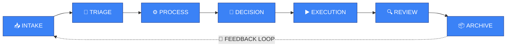
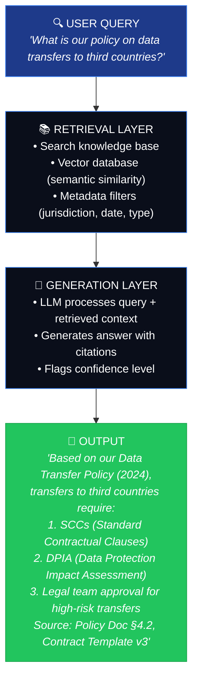
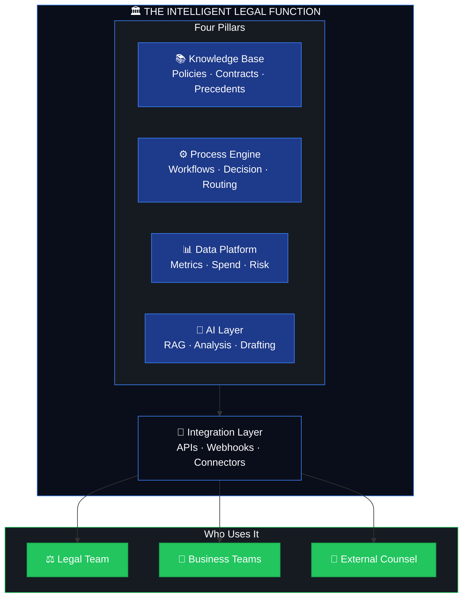

# The Legal Tech Landscape: A Guided Journey

<div align="center">


</div>

---

## 🎯 What This Is (And What It Isn't)

This is not a dictionary. You won't find alphabetical definitions here.

This is a **map**. It tells the story of how legal technology evolved from simple document storage to intelligent, AI-powered systems—and why understanding that journey matters if you want to implement any of it successfully.

**Read this if:**
- You're a lawyer trying to understand what "legal tech" actually means for your practice
- You're a Legal Ops professional evaluating vendors and tools
- You're an engineer joining a legal team and need context
- You're a decision-maker trying to understand why implementations fail

**By the end, you'll understand:**
- Why legal tech is more than just software
- How vendors, tools, and roles evolved together
- Why implementation is a multi-disciplinary discipline
- Why adoption depends on process design, not technology
- How AI and regulation (GDPR, EU AI Act) changed everything

---

## 📍 Chapter 1: The Starting Point — What Is Legal Tech?

**Legal tech** is the use of technology to deliver, improve, or transform legal services and operations.

That's it. Simple definition. But the implications are enormous.

Legal tech is not:
- ❌ Just software for lawyers
- ❌ Just automation
- ❌ Just AI
- ❌ Just a CLM or an e-signature tool

Legal tech **is**:
- ✅ A discipline that combines law, process design, technology, and change management
- ✅ A way of thinking about how legal work gets done
- ✅ A multi-disciplinary practice that touches every part of a business

**Why this matters:** Most implementations fail because organizations treat legal tech as a software purchase. It's not. It's a transformation of how legal work is designed, executed, and measured.

📖 *For a deeper definition, see [What is Legal Tech?](./what-is-legal-tech.md)*

---

## 📍 Chapter 2: The First Wave — Vendors and Tools

Before there were "legal engineers" or "legal ops," there were **vendors selling software to law firms and legal departments**.

### The Early Landscape

The first legal tech tools solved simple, specific problems:

| Era | Tool Type | What It Solved | Example |
|-----|-----------|---------------|---------|
| 2000s | **Document Management** | Where do we store files? | iManage, NetDocuments |
| 2000s | **Practice Management** | How do we track cases and time? | Clio, PracticePanther |
| 2010s | **E-Discovery** | How do we review millions of documents? | Relativity, Everlaw |
| 2010s | **E-Signature** | How do we sign without printing? | DocuSign, Adobe Sign |
| 2010s | **Office Automation** | How do we generate documents faster? | Word templates, HotDocs |

**Key insight:** Each tool solved one problem. Lawyers bought them individually. There was no "system"—just a collection of disconnected tools.

### The Rise of CLMs

The first major shift was the emergence of **Contract Lifecycle Management (CLM)** platforms.

A CLM doesn't just store contracts. It manages the entire life of a contract:
- **Creation** → Drafting from templates
- **Negotiation** → Collaboration and redlining
- **Approval** → Internal workflows and sign-offs
- **Execution** → E-signature
- **Storage** → Centralized repository
- **Obligation Management** → Tracking what each party must do
- **Renewal/Expiration** → Alerts and lifecycle management

**Why CLMs mattered:** They were the first tool that forced legal teams to think about **processes**, not just documents. You couldn't implement a CLM without mapping your contract workflow first.

### The Vendor Ecosystem Today

Today's legal tech vendor landscape includes:

- **CLM Platforms:** Icertis, Ironclad, ContractPodAi, Juro
- **E-Discovery:** Relativity, Disco, Everlaw
- **Practice Management:** Clio, Filevine, Litify
- **Document Automation:** HotDocs, ContractExpress, Gavel
- **Legal Research:** Westlaw, LexisNexis, Casetext
- **AI-Powered Tools:** Harvey, CoCounsel (Thomson Reuters), Legora, Luminance
- **Enterprise Platforms:** Microsoft Copilot for Legal, Anthropic for Enterprise

**Key insight:** Vendors name their tools—and their roles—according to their commercial needs. There is no industry standard for job titles in legal tech. When a vendor says they need a "Legal AI Prompt Engineer," that's their internal decision, not a universally recognized role. Understanding this prevents confusion when evaluating job postings, vendor teams, or your own hiring needs.

📖 *For a detailed breakdown of roles and titles, see [Roles in Legal Tech](./roles.md)*

---

## 📍 Chapter 3: The Second Wave — Legal Operations and Process Thinking

Having tools wasn't enough. Organizations realized they needed people who could **manage the tools, optimize the processes, and measure the outcomes**.

Enter **Legal Operations**.

### What Is Legal Operations?

Legal Operations is the discipline of running a legal department like a business function—focused on efficiency, cost control, technology adoption, and strategic alignment.

The **CLOC (Corporate Legal Operations Consortium)** framework identifies 12 core competencies:

1. **Business Intelligence** — Data-driven decision making
2. **Cross-Functional Alignment** — Legal working with IT, HR, Finance
3. **Financial Management** — Budget, spend analytics, outside counsel management
4. **Firm & Vendor Management** — Evaluating and managing external providers
5. **Information Governance** — Records management, data retention
6. **Knowledge Management** — Capturing and reusing institutional knowledge
7. **Legal Project Management** — Scoping, tracking, delivering legal work
8. **Litigation Support** — Managing disputes efficiently
9. **Organizational Design** — Structuring the legal team for impact
10. **Process Improvement** — Identifying and eliminating waste
11. **Service Delivery Models** — Who does what (internal vs external vs self-service)
12. **Technology & Process Support** — Selecting, implementing, and managing tools

**Key insight:** Legal Operations shifted the conversation from "what tool should we buy?" to "how should legal work be designed, delivered, and measured?"

### The Specialization of Roles

As Legal Ops matured, roles became more specialized:

| Role | Focus | Key Skills |
|------|-------|------------|
| **Legal Ops Manager** | Overall department efficiency | Strategy, vendor management, budget |
| **Legal Project Manager** | Individual matter execution | LPM, scoping, tracking |
| **Legal Technologist** | Tool selection and adoption | Vendor evaluation, training, change management |
| **Legal Engineer** | Building workflows and automation | Process design + code |
| **Legal Data Analyst** | Metrics and insights | SQL, dashboards, spend analytics |

**This is where "Legal Engineer" first appeared** — not as a marketing title, but as a genuine need: someone who could both understand the legal process AND write the code to automate it.

---

## 📍 Chapter 4: The Third Wave — Automation and Intelligent Workflows

Once organizations understood their processes (thanks to Legal Ops), the next question was: **"Can we automate this?"**

### From Templates to Workflows

Automation in legal tech evolved in stages:

```
Stage 1: Document Templates
         "Fill in the blanks in this Word doc"

Stage 2: Document Assembly
         "Answer these questions, get a finished document"

Stage 3: Workflow Automation
         "When X happens, automatically do Y, then route to Z"

Stage 4: Intelligent Workflows
         "When X happens, analyze the context, decide the best action,
          execute it, and learn from the outcome"
```

### Why Most Automation Fails

Here's the uncomfortable truth: **most legal automation projects fail not because of bad technology, but because of bad process design.**

Common failure patterns:

| ❌ Failure Pattern | 🎯 Root Cause |
|--------------------|---------------|
| Built a tool nobody uses | No intake analysis — didn't understand how work actually arrives |
| Automated the wrong thing | No triage — automated low-value work while high-value work stayed manual |
| Tool doesn't fit the process | No process mapping — forced people into rigid workflows |
| Low adoption across regions | No localization — one-size-fits-all doesn't work in multinational legal teams |
| Tool breaks after 6 months | No maintenance plan — processes change, tools must adapt |

### The Intake-to-Archive Framework

Successful legal automation follows a complete lifecycle:



Each stage requires different skills and decisions:

- **Intake:** How does legal work enter the system? (Forms, email, API, Slack)
- **Triage:** How is it classified and prioritized? (Risk, urgency, value)
- **Process:** What workflow applies? (Contract review, litigation, compliance)
- **Decision:** Who or what decides the next step? (Rules engine, human, AI)
- **Execution:** What gets done? (Draft, review, approve, file)
- **Review:** Was it done correctly? (QA, compliance check)
- **Archive:** How is it stored and retrievable? (DMS, metadata, retention)

**Key insight:** Automation is not about replacing lawyers. It's about designing processes so that the right work goes to the right person (or system) at the right time, with the right context.

---

## 📍 Chapter 5: The Fourth Wave — AI, RAG, and the New Frontier

Artificial Intelligence didn't just add a new tool to the legal tech stack. It changed the fundamental architecture of how legal knowledge is stored, retrieved, and applied.

### From Search to Generation

The evolution of legal AI:

```
Phase 1: Keyword Search
         "Find documents containing 'indemnification'"

Phase 2: Semantic Search
         "Find documents about liability protection"

Phase 3: Summarization
         "Summarize this 200-page contract"

Phase 4: Generation (LLMs)
         "Draft an indemnification clause for a SaaS agreement"

Phase 5: Grounded Generation (RAG)
         "Based on our actual contracts and policies, what is our
          standard indemnification position, and draft a clause
          consistent with it"
```

### Why RAG Matters in Legal

**RAG (Retrieval-Augmented Generation)** is the most important architecture in legal AI today. Here's why:

1. **LLMs hallucinate.** They can invent case law, statutes, and contract terms that don't exist. In legal work, this is not just embarrassing—it's malpractice.

2. **Legal data is private.** Client contracts, privileged communications, internal policies—this data cannot be sent to third-party AI APIs without violating confidentiality and GDPR.

3. **RAG solves both problems.** It retrieves relevant documents from your own knowledge base first, then uses the LLM to generate answers grounded in those documents. The data stays on your infrastructure.

### The New Architecture

A RAG-based legal system requires:



### The Regulatory Layer: GDPR and EU AI Act

AI in legal work doesn't exist in a vacuum. European regulation shapes every architectural decision:

| Regulation | What It Requires | How It Affects Legal AI |
|-----------|------------------|------------------------|
| **GDPR** | Data minimization, purpose limitation, right to erasure, data sovereignty | You can't send client data to US-based APIs without safeguards. RAG on local infrastructure solves this. |
| **EU AI Act** | Risk classification (unacceptable → high → limited → minimal), transparency, human oversight | A contract analysis tool that recommends legal actions = high-risk. Requires conformity assessment, logging, human review. |
| **EU AI Act (Art. 5)** | Prohibited AI practices | AI systems that manipulate legal outcomes or deny access to justice are prohibited. |

**Key insight:** Compliance is not an afterthought. It shapes your architecture from day one. Privacy-by-design means choosing self-hosted models over APIs, implementing access controls, and building audit trails.

---

## 📍 Chapter 6: The Real Challenge — Adoption and Integration

The hardest part of legal tech is not building the tool. It's getting people to use it.

### Why Adoption Fails

| Reason | Example |
|--------|---------|
| **No stakeholder involvement** | Legal team wasn't consulted during design |
| **One-size-fits-all** | Same workflow for a 3-person team and a 500-person multinational |
| **No training** | "Here's the tool, figure it out" |
| **No feedback loop** | Tool launched, never improved based on user experience |
| **Cultural resistance** | "We've always done it this way" |
| **No executive sponsorship** | No one with authority championed the change |

### Designing for Adoption

Successful legal tech implementation follows these principles:

1. **Start with the process, not the tool.** Map how work actually happens today before designing how it should happen tomorrow.

2. **Involve users from intake.** The people who will use the system must participate in designing it. Not as a formality—genuinely.

3. **Design for the specific organization.** Every business is different. A law firm's workflow is not a corporation's workflow. A German legal team's process is not a Chilean team's process.

4. **Build incrementally.** Don't launch a massive system. Start with one workflow, measure results, iterate, expand.

5. **Measure adoption, not just deployment.** The metric is not "tool installed." It's "percentage of legal work flowing through the system."

### The Multinational Challenge

For organizations with legal teams across multiple countries and regions:

- **Legal frameworks differ** — A contract workflow for Spain is not valid for Chile
- **Languages differ** — Tools must support multilingual content and interfaces
- **Cultures differ** — Change management in Germany is different from change management in Brazil
- **Data sovereignty differs** — GDPR in Europe, LGPD in Brazil, local laws everywhere
- **Centralization vs localization** — Some processes should be global (CLM), others must be local (litigation)

**Key insight:** The goal is not to impose a single global system. It's to create a framework that allows local adaptation while maintaining global visibility and governance.

---

## 📍 Chapter 7: Beyond CLMs — The Intelligent Legal Function

The future of legal tech is not about individual tools. It's about creating an **intelligent legal function** that is embedded in the business.

### What This Looks Like



### The Four Pillars

| Pillar | What It Is | Why It Matters |
|--------|-----------|----------------|
| **Knowledge Base** | Centralized, searchable repository of legal knowledge (policies, contracts, precedents, regulatory requirements) | Without it, every question starts from scratch |
| **Process Engine** | Automated workflows that route legal work through the right steps, people, and approvals | Without it, work is ad hoc and unmeasurable |
| **Data Platform** | Metrics, analytics, and insights about legal operations (spend, cycle time, risk, adoption) | Without it, you can't improve what you can't measure |
| **AI Layer** | Intelligent assistance grounded in your knowledge base (RAG, document analysis, drafting) | Without it, you're leaving efficiency and insight on the table |

**Key insight:** None of these pillars works alone. A knowledge base without a process engine is just a filing cabinet. A process engine without a knowledge base is just a routing system. The transformation happens when they work together.

---

## 🔗 Where to Go Next

Based on what you've learned here, choose your path:

| If you want to understand... | Go to... |
|------------------------------|----------|
| The specific roles and who does what | [Roles in Legal Tech](./roles.md) |
| How to design legal processes from intake to archive | [02-process-design/intake.md](../02-process-design/intake.md) |
| The specific technologies (AI, RAG, CLM, etc.) | [03-technologies/](../03-technologies/) |
| How to evaluate and implement tools | [02-process-design/build-vs-buy.md](../02-process-design/build-vs-buy.md) |

---

## ✍️ About This Document

Written by **Rafael Montaner** — Licensed Attorney and Software Developer.

This document reflects over a decade of experience at the intersection of law and technology, including:
- Redesigning legal workflows that reduced processing time by 80%
- Building full-stack legal applications deployed across Chile, Argentina, and Spain
- Designing RAG architectures for global corporations under GDPR and EU AI Act constraints
- Advising legal departments on technology adoption and process optimization

Have feedback, corrections, or additions? See [CONTRIBUTING.md](../CONTRIBUTING.md)

---

<div align="center">

*This is a living document. The legal tech landscape evolves fast.*

*Last updated: 2026*

</div>
