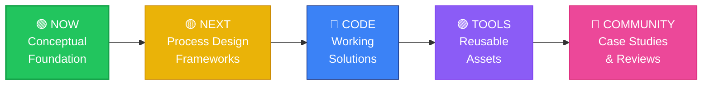

<div align="center">


</div>

```bash
 ██       ███████  ██████   █████  ██         ████████ ███████  ██████ ██   ██
 ██       ██      ██       ██   ██ ██            ██    ██      ██      ██   ██
 ██       █████   ██ █████ ███████ ██            ██    █████   ██      ███████
 ██       ██      ██    ██ ██   ██ ██            ██    ██      ██      ██   ██
 ███████  ███████  ██████  ██   ██ ███████       ██    ███████  ██████ ██   ██

  ██████   ██       ██████   ██████   █████  ██████  ██    ██
 ██        ██      ██    ██ ██       ██   ██ ██   ██  ██  ██
 ██  ████  ██      ██    ██  ██████  ███████ ██████    ████
 ██    ██  ██      ██    ██       ██ ██   ██ ██   ██    ██
  ██████   ███████  ██████   ██████  ██   ██ ██   ██    ██

╔══════════════════════════════════════════════════════════════════════╗
║  v1.3.0                                                              ║
║  Legal Operations Knowledge Base                                     ║
╠══════════════════════════════════════════════════════════════════════╣
║                                                                      ║
║  $ whoami                                                            ║
║  > Rafael Montaner — Attorney + Software Developer                   ║
║                                                                      ║
║  $ cat status.json                                                   ║
║  {                                                                   ║
║    "status": "🟢 Active Development",                                ║
║    "license": "MIT",                                                 ║
║    "focus": "Legal Ops + Process + Technology",                      ║
║    "market": ["USA", "Canada", "Europe"]                             ║
║  }                                                                   ║
║                                                                      ║
║  $ echo $MISSION                                                     ║
║  > Legal Ops isn't about tools. It's about designing how legal       ║
║  > work gets done. Technology is just the enabler.                   ║
║                                                                      ║
╚══════════════════════════════════════════════════════════════════════╝
```

<div align="center">

[](https://opensource.org/licenses/MIT)
[](./CONTRIBUTING.md)
[](./CONTRIBUTING.md)
[](https://github.com/gudaraz/legal-tech-glossary/stargazers)

**[🚀 Start Here](#-start-here)** · **[📚 Browse Content](#-learning-paths)** · **[🤝 Contribute](./CONTRIBUTING.md)** · **[💡 Request a Topic](https://github.com/gudaraz/legal-tech-glossary/issues/new)** · **[⭐ Star](https://github.com/gudaraz/legal-tech-glossary)**

</div>

---

## 🚀 START HERE

```bash
$ ./start-here.sh
```

<div align="center">

### 👉 New to Legal Ops? Start with [01-foundations/](./01-foundations/)

**This is not just a glossary.** It's a comprehensive resource for Legal Operations professionals who need to understand people, processes, and technology.

</div>

### 🎯 Who Should Use This?

| If you are... | Start here | Why |
|---------------|-----------|-----|
| 🎓 **Lawyer moving to Legal Ops** | [01-foundations/glossary.md](./01-foundations/glossary.md) | Understand the landscape, vendors, and evolution |
| 💻 **Engineer joining Legal Ops team** | [01-foundations/roles.md](./01-foundations/roles.md) | Understand roles, then jump to [03-technologies/](./03-technologies/) |
| 📊 **Legal Ops Professional** | [02-process-design/](./02-process-design/) | Deep dive into workflow design and optimization |
| 🤔 **Just curious about Legal Ops** | [01-foundations/glossary.md](./01-foundations/glossary.md) | The complete narrative journey |

**The recommended path:**

```
01-foundations/ → 02-process-design/ → 03-technologies/
   (What & Why)      (How to design)     (What tools)
```

---

## 🎯 The Problem

```bash
$ cat problem.txt
```

Legal Operations is more than just buying tools. It's about **designing how legal work gets done**.

| ❌ What Happens | 💰 The Cost |
|----------------|-------------|
| Legal Ops = buying software | Wasted budget on unused tools |
| No process design, just automation | Failed implementations |
| Technology without strategy | Low adoption, frustrated teams |
| Siloed approach (tools vs people vs process) | Millions lost annually |

**This resource fixes that by treating Legal Ops as a discipline, not a shopping list.**

---

## 🗺️ Repository Structure

```bash
$ tree -L 2 -a
```

```
legal-tech-glossary/
│
├──  README.md                      ← You are here
├──  CONTRIBUTING.md                ← How to contribute
├──  LICENSE                        ← MIT License
│
├──  01-foundations/                ← START HERE
│   ├── README.md
│   ├── glossary.md                   ✅ The narrative journey
│   ├── roles.md                      🚧 Coming soon
│   └── what-is-legal-tech.md         🚧 Coming soon
│
├── 📂 02-process-design/             ← How to design workflows
│   ├── README.md
│   ├── intake.md                     🚧 Coming soon
│   ├── triage.md                     🚧 Coming soon
│   ├── decision-engine.md            🚧 Coming soon
│   ├── build-vs-buy.md               🚧 Coming soon
│   └── workflow-optimization.md      🚧 Coming soon
│
├──  03-technologies/               ← Tools and technologies
│   ├── README.md
│   ├── ai-and-llms.md                🚧 Coming soon
│   ├── rag-and-knowledge.md          🚧 Coming soon
│   ├── clm-and-contracts.md          🚧 Coming soon
│   ├── automation-and-workflow.md    🚧 Coming soon
│   ├── compliance-and-governance.md  🚧 Coming soon
│   └── legal-operations.md           🚧 Coming soon
│
├── 📂 04-code-examples/              ← Working solutions (future)
│   └── (POCs, scripts, templates)    💻 Coming soon
│
└── 📂 templates/
    └── term-template.md
```

**Legend:**
- ✅ = Available now (start here)
- 🚧 = Coming soon
- 💻 = Future code examples

---

## 🔮 What This Repo Will Become



### Development Roadmap

| Phase | What You'll Find | Timeline |
|-------|------------------|----------|
| 🟢 **Now** | Conceptual foundations, narrative glossary, role definitions | ✅ Live |
| 🟡 **Next** | Process design guides, intake frameworks, BPMN templates | 2-4 weeks |
| 🔵 **Code** | Python/Django POCs, RAG implementations, automation scripts | 1-2 months |
| 🟣 **Tools** | Reusable starter kits, compliance checkers, workflow generators | 3-4 months |
| 🩷 **Community** | Case studies, multilingual support, vendor-neutral reviews | Ongoing |

---

## 📚 Learning Paths

```bash
$ ./learning-paths --help
```

### 🟢 Level 1: Foundations (START HERE)

**Goal:** Understand Legal Ops as a discipline, the landscape, and basic vocabulary.

| 📖 Topic | 📝 What You'll Learn | ⏱️ Time | Status |
|----------|----------------------|---------|--------|
| [**The Legal Ops Landscape**](./01-foundations/glossary.md) | Evolution: vendors → legal ops → automation → AI → regulation | 25 min | ✅ Available |
| [**Roles in Legal Ops**](./01-foundations/roles.md) | Legal Engineer vs Legal Ops vs inflated titles | 15 min | 🚧 Coming soon |
| [**What is Legal Tech?**](./01-foundations/what-is-legal-tech.md) | Clear definition, scope, and misconceptions | 10 min | 🚧 Coming soon |

**Who should start here?**
- Lawyers transitioning to Legal Ops
- Engineers joining Legal Ops teams
- Anyone wanting to understand the field

---

### 🟡 Level 2: Process Design

**Goal:** Learn how to design, optimize, and automate legal workflows from intake to archive.

| 📖 Topic |  What You'll Learn | ️ Time | Status |
|----------|----------------------|---------|--------|
| [**Intake & Matter Creation**](./02-process-design/intake.md) | How to capture legal requests effectively | 20 min | 🚧 Coming soon |
| [**Triage & Prioritization**](./02-process-design/triage.md) | Classifying and routing matters efficiently | 15 min | 🚧 Coming soon |
| [**Decision Engines**](./02-process-design/decision-engine.md) | Building IF/THEN logic for legal workflows | 25 min | 🚧 Coming soon |
| [**Build vs Buy**](./02-process-design/build-vs-buy.md) | When to build custom vs buy off-the-shelf | 20 min | 🚧 Coming soon |
| [**Workflow Optimization**](./02-process-design/workflow-optimization.md) | Identifying bottlenecks and improving efficiency | 30 min | 🚧 Coming soon |

**Who should focus here?**
- Legal Ops professionals designing workflows
- Legal Engineers building automation
- Law firm managers optimizing operations

---

### 🔵 Level 3: Technologies

**Goal:** Deep dive into the specific tools, frameworks, and technologies powering Legal Ops.

| 📖 Category | 🔧 Technologies Covered | 📊 Terms | Status |
|-------------|-------------------------|----------|--------|
| 🤖 [**AI & LLMs**](./03-technologies/ai-and-llms.md) | Large Language Models, prompt engineering, fine-tuning | 12 | 🚧 Coming soon |
| 🧠 [**RAG & Knowledge**](./03-technologies/rag-and-knowledge.md) | Retrieval-Augmented Generation, embeddings, vector DBs | 10 | 🚧 Coming soon |
| 📄 [**CLM & Contracts**](./03-technologies/clm-and-contracts.md) | Contract Lifecycle Management, e-signature, clauses | 9 | 🚧 Coming soon |
| ⚙️ [**Automation & Workflow**](./03-technologies/automation-and-workflow.md) | BPMN, RPA, low-code, process mining | 11 | 🚧 Coming soon |
| 🛡️ [**Compliance & Governance**](./03-technologies/compliance-and-governance.md) | GDPR, EU AI Act, data sovereignty, ethics | 8 | 🚧 Coming soon |
| 📊 [**Legal Operations**](./03-technologies/legal-operations.md) | LPM, matter management, spend analytics | 7 | 🚧 Coming soon |

**Total: 57+ terms planned** 📈

**Who should dive deep here?**
- Engineers implementing specific technologies
- Legal Ops professionals evaluating vendors
- Anyone needing technical depth

---

## 🔥 Featured Topics

```bash
$ cat featured-topics.md
```

### 🧠 RAG (Retrieval-Augmented Generation)

> Instead of relying only on what an AI "remembers," RAG lets it **look up relevant documents first**, then generate answers based on what it finds.

| Perspective | Explanation |
|-------------|-------------|
| ⚖️ **For Lawyers** | Your AI reads your actual contract database before answering—instead of making things up. |
| 🛠️ **For Engineers** | Retrieve chunks from a vector DB → inject into LLM prompt → generate grounded response. |
| 💼 **Real Use** | Compliance team asks about data transfer policy → RAG retrieves GDPR docs → LLM answers with citations. |

📖 **Full explanation:** [01-foundations/glossary.md - Chapter 5](./01-foundations/glossary.md)

---

### ⚙️ BPMN (Business Process Model and Notation)

> A standardized way to draw **flowcharts that show how a process works**, step by step.

| Perspective | Explanation |
|-------------|-------------|
| ⚖️ **For Lawyers** | How you map "what happens when a client signs" so legal, tech, and business all understand. |
| 🛠️ **For Engineers** | The blueprint for automation. No BPMN = no specs = building in the dark. |
| 💼 **Real Use** | Succession process: receive case → verify docs → identify heirs → draft deed → file. |

📖 **Full explanation:** [03-technologies/automation-and-workflow.md](./03-technologies/automation-and-workflow.md) *(coming soon)*

---

### 🛡️ EU AI Act Risk Classification

> The EU's way of sorting AI systems by **how dangerous they could be**, from "no risk" to "unacceptable."

| Perspective | Explanation |
|-------------|-------------|
| ⚖️ **For Lawyers** | Determines what compliance hoops your legal tech tool must jump through. |
| 🛠️ **For Engineers** | Regulatory constraint that shapes your entire architecture. |
| 💼 **Real Use** | Contract tool recommending legal actions = high-risk. Case law summarizer = limited risk. |

📖 **Full explanation:** [01-foundations/glossary.md - Chapter 5](./01-foundations/glossary.md)

---

## 📰 Related Content

```bash
$ cat blog-posts.md
```

I write about Legal Ops, legal technology, and the intersection of law and engineering on LinkedIn. Here are key posts that complement this resource:

| 📅 Date | 📝 Title | 🏷️ Topic | 🔗 Link |
|---------|----------|----------|---------|
| Jun 2026 | Why Most Legal AI Projects Fail (And How to Fix Them) | AI Strategy | [Read →](https://www.linkedin.com/in/rafaelmontaner) |
| May 2026 | RAG in Legal Ops: Beyond the Hype | RAG | [Read →](https://www.linkedin.com/in/rafaelmontaner) |
| Apr 2026 | The EU AI Act: What Legal Ops Builders Need to Know | Compliance | [Read →](https://www.linkedin.com/in/rafaelmontaner) |
| Mar 2026 | BPMN for Lawyers: A Practical Guide | Process Design | [Read →](https://www.linkedin.com/in/rafaelmontaner) |
| Feb 2026 | Why I Built This Resource | Meta | [Read →](https://www.linkedin.com/in/rafaelmontaner) |

**Want more?** Follow me on [LinkedIn](https://www.linkedin.com/in/rafaelmontaner) for weekly insights.

---

## 🔄 This Is a Living Resource

```bash
$ git log --oneline
```

The Legal Ops landscape evolves fast. New tools emerge, regulations change, and best practices shift. This resource evolves with it.

**What "living resource" means:**
- ✅ Content is updated regularly as the field evolves
- ✅ Community contributions are welcomed and reviewed
- ✅ Mistakes are corrected quickly
- ✅ New topics are added based on demand
- ✅ Code examples are tested and maintained

**How to stay updated:**
- ⭐ **Star this repo** to get notifications
- 👀 **Watch** for all changes
- 💼 **Follow me on LinkedIn** for announcements

---

## 🤝 Contributing

```bash
$ git contribute --help
```

This is a living resource. The Legal Ops landscape evolves fast, and we need the community to keep this current.

**You don't need to know Git to contribute.** See [CONTRIBUTING.md](./CONTRIBUTING.md) for:
- 🟢 **Path A:** Email or LinkedIn (no Git required)
- 🔵 **Path B:** Fork, branch, PR (for developers)
- 🟡 **Path C:** Suggest a topic without writing it

**First-time contributors welcome!**

---

## 📬 Stay Connected

```bash
$ cat contact.json
```

```json
{
  "maintainer": "Rafael Montaner",
  "role": "Legal Engineer & Legal Ops Consultant",
  "linkedin": "linkedin.com/in/rafaelmontaner",
  "website": "www.rafaelmontaner.com",
  "email": "rafael.montaner@gmail.com"
}
```

---

## 📄 License

```bash
$ head -1 LICENSE
```

MIT License — Use it, share it, remix it. Just give credit.

---

<div align="center">

```bash
$ echo "Go build something amazing."
```

### ⭐ If this helps you, star the repo!

**Built with ❤️ by [Rafael Montaner](https://www.rafaelmontaner.com)**

```bash
$ exit
logout
```


</div>
